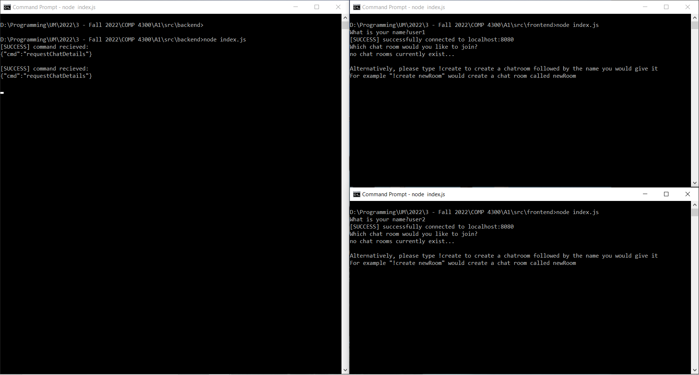
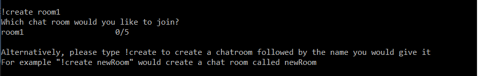
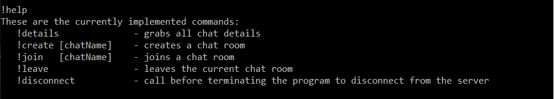
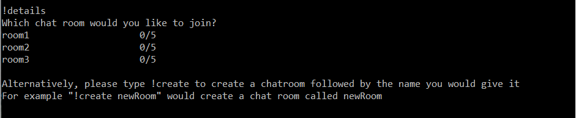
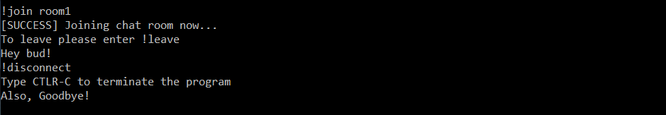

<div align='center'>

# TCP Console Chat

</div>

<br>
<br>

<div align='right'>

</div>

<br>

## Setup: 
1. Run ```npm install```
2. Open terminals (at least 1 client and server are required) 
3. Select a terminal to be designated as the server then run the following command ```node src/backend/index.js```
4. For as many clients as you'd like run the following command ```node src/frontend/index.js```
5. Give each client an appropriate name


## Comands 
### 1. Create a chat room 

Fresh servers always start empty. This means clients must create all chatrooms using the command **!create [chat room name]**. Please note this command can be ran regardless of if the user is in a chat room and that a chatroom is only created if its unique.   

<div align='right'>

</div>

### 2. Join a chat room 

To join a chat room the client must use the command **!join [chat room name]**. If the chat room does not exist or 5 users are already inside of it, a list of currently available chat rooms will be displayed alongside a list of users and their user count instead. Please note this command can be ran regardless of if the user is in a chat room. 

<div align='right'>

</div>

### 3. Send messages 

Once in a chat room, the user can type whatever they’d like, however, any chats starting with a ! will be interpreted as a command. If other users are present and type, their messages alongside their name will also be displayed. If any messages are received while a user is entering their next message, it is possible that the chat will pause temporarily as the message is loaded thus interfering with the user’s input 

### 4. Leave a chat room 

When a user decides to leave a chat, the command they must use is **!leave**. This will exit the user and display the currently available chat rooms. Whilst the leave command makes most sense in a chat room, please note this command can be ran regardless of if the user is in a chat room. 

### 5. Extra: 
- Confused by commands? 

Users can read more information on the system’s available commands at any time by calling the command **!help** 

<div align='right'>

</div>

<br>

- Forget what chat rooms are available? 

Users can reprint chat rooms and their availability by using the command **!details** 

<div align='right'>

</div>

<br>

- Disconnect? 

If a user wishes to leave the chat server, they must first disconnect. This can be performed using the command **!disconnect**. Please note this command can be ran regardless of if the user is in a chat room. 

<div align='right'>

</div>

<br>
<br>
<br>

<div align='center'>

**NOTE**: all commands are identified with a ! as their first character, any and all following 

</div>